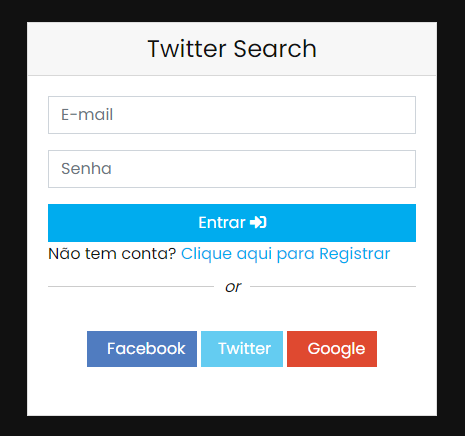
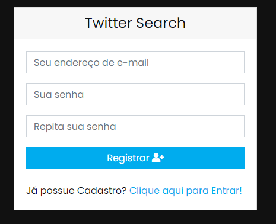
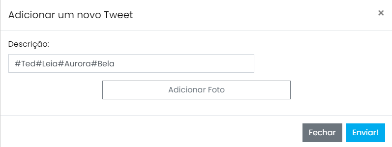
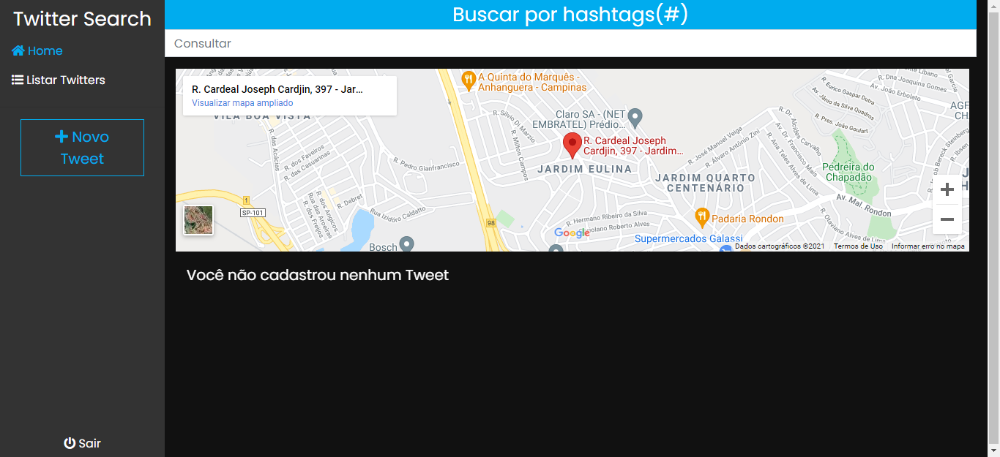
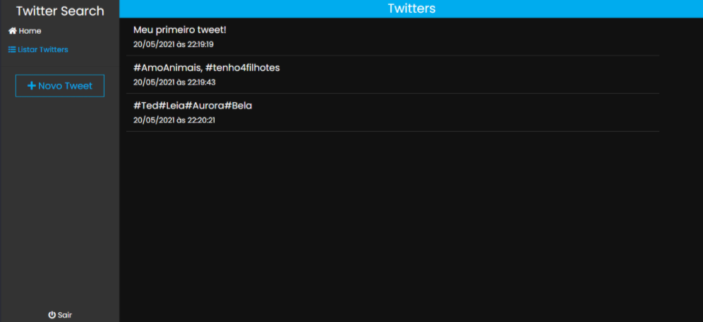

# Funcionalidades🐦🐦🐤
- Cadastrar Tweets no firebase
- Cadastrar usuario/senha
- Efetuar Login
- Ver Tweets postados
- Sair e logar na aplicação com tweet salvos
- Adicionar Foto ao Tweet
- Ver foto salva
  
## Tecnologias principais

- Vue.js
- Vue Router
- Firebase 
- Bootstrap 

### Rodando o projeto local

- Clone o projeto na sua máquina;
- Instale as dependências usando `npm i`
- Renomeie o arquivo `.env.local.example` para `.env.local`;
- Crie uma conta no [Firebase](https://firebase.google.com/) (basta ter uma conta do Google);
- No console, adicione um novo projeto e dê o nome que preferir;
- Copie as credenciais do projeto para o ambiente Web e coloque-as em seus devidos locais dentro do arquivo `.env.local`;
- Ative o método de login para E-mail/senha;
- Ative o realtime database dentro do console do Firebase;
- Execute `npm run serve` para subir um servidor local para desenvolvimento com hot reload ativado.
- Execute `npm install eslint-plugin-vue -u` para instalar as dependências


### Compilar arquivos minificados para produção

Para criar os arquivos minificados prontos para serem colocados em um servidor web basta executar

```npm
npm run build
```

### Fazer o deploy para o firebase

Para usar o serviço de hosting do firebase basta executar os seguintes passos:

- Crie uma pasta deploy na raiz do projeto;
- Com o [firebase-tools](https://github.com/firebase/firebase-tools) instalado na máquina execute `firebase init` dentro da pasta deploy recém criada.

Se estiver no Linux ou MacOS basta executar

```npm
npm run deploy
```

No windows é preciso fazer o procedimento na mão:

- Execute `npm run build`;
- Copie o conteúdo de dentro da pasta /dist para dentro da pasta /deploy/public;
- Execute `firebase deploy` dentro da pasta /deploy.

## Próximas Features:
- Filtrar busca por tweet
- Adicionar mapas com a localização dos tweets
- Realizar integração com a aplicação e as Apis do Twitter.


## Imagens do projeto

**Tela Login**



**Tela Cadastro**



**Tela novo Tweet**




**Tela de Início**



**Tela de Tweets**



**Tela ver Foto**


